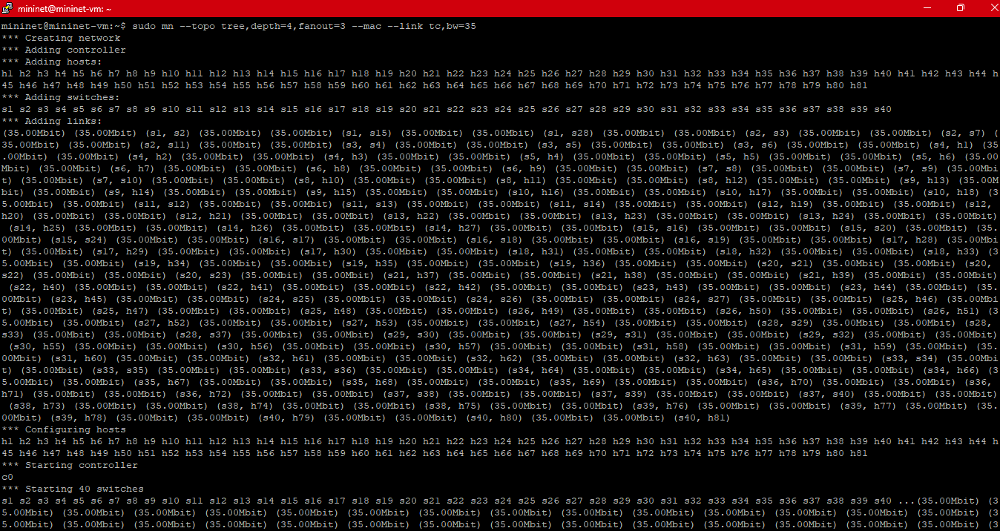
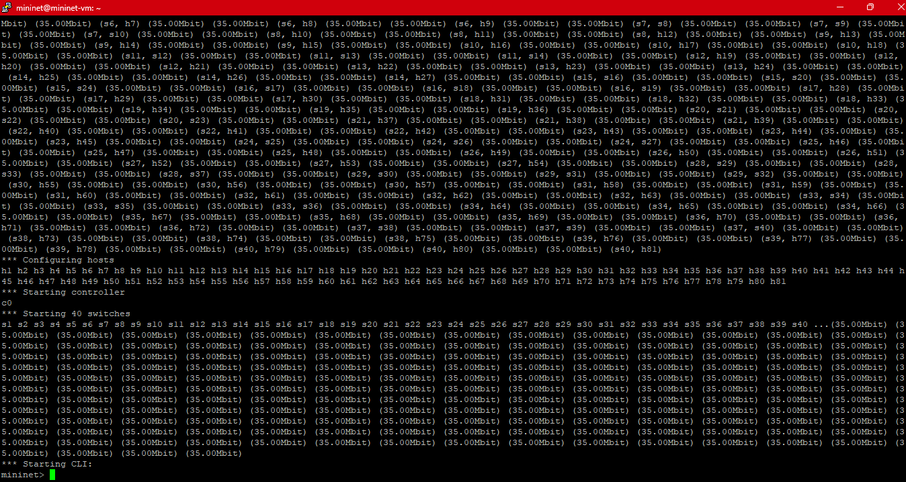
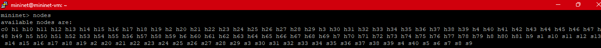
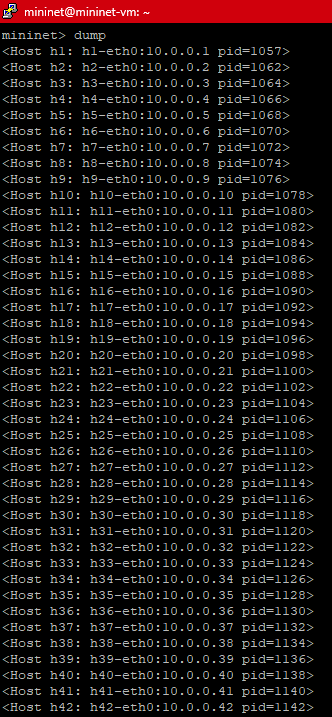
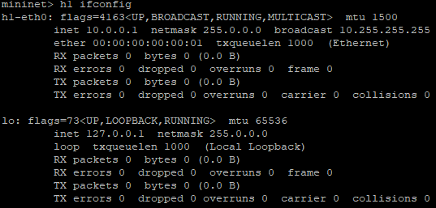

# Trabalho Final - Mininet

Este repositório contém a solução para o trabalho final da disciplina de C115 utilizando Mininet. O projeto é dividido em duas partes principais: uma topologia em árvore criada via linha de comando e uma topologia customizada desenvolvida em Python que está disponível no arquivo `tree.py`.

---

## Tecnologias e Ferramentas

- Mininet VM
- PuTTY
- Xming
- Python 3 instalado

---

## Questão 1: Topologia em Árvore
Objetivo: Criar uma topologia em árvore com profundidade 4 e ramificação 3, utilizando linha de comando.

a) Criar topologia:  `sudo mn --topo tree,depth=4,fanout=3 --mac --link tc,bw=35`

b) Inspeção de interfaces: 
- `nodes` 

- `dump`

- `h1 ifconfig`

